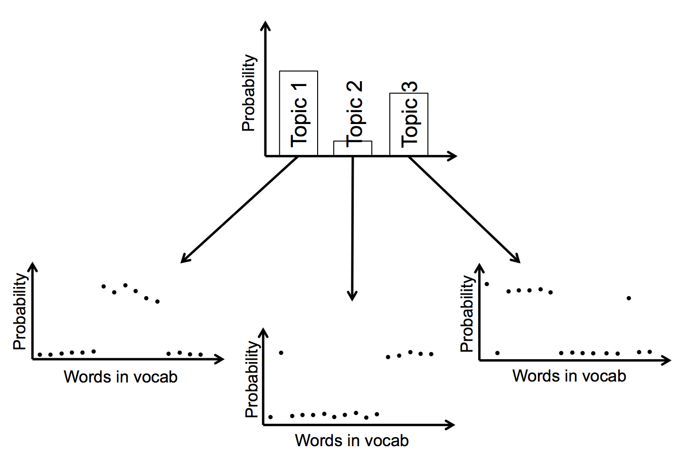

# Latent Dirichlet Allocation (LDA)

## TL; DR
* Latent Dirichlet Allocation is a probabilistic method for [*Topic*](Topics.md) Modelling.
* We have to choose the number of topics *k* that we want to 'discover' in our [*corpus*](Glossary.md#corpus).
* The results then find these hidden topics, and give us the words that make up each topic, in the form of a probability distribution over thje [*vocabulary*](Glossary.md#vocab) for each topic.
* They also give us the topical mix for each [*document*](Glossary.md#document), in the form of a probability distribution over the topics for each [*document*](Glossary#document).
* Unfortunately we have encountered two major problems with the results when we've tried this. These problems may be with our implementations rather than with the method, but we have tried on different data (and colleagues from another department independently had the same problems).
* The main problem is that the assignment of topics to [*document*](Glossary.md#document) does not appear to be sensible - we found that [*documents*(Glossary.md#document)] with identical wording were being stated as having wildly different topical content.
* The secondary problem is that the topics themselves are extremely challenging to describe in a semantically-meaningful way; rather they often seem to be arbitrary lists of words whose co-appearance in [*documents*](Glossary.md#document) is not indicative of any thematic commonality.
* We have stopped trying to implement LDA for the moment.

## Before we start

In common with some of the [*clustering*](Glossary.md#cluster) algorithms below, for this method we need to define the number *k* of topics in our [*corpus*](Glossary.md#corpus).

## What does LDA give us?

LDA is a probabilistic method. For each [*document*](Glossary.md#document) the results give us a mix of topics that make up that [*document*](Glossary.md#document). To be precise, we get a probability distribution over the *k* topics for each [*document*](Glossary.md#document). Each word in the [*document*](Glossary.md#document) is attributed to a particular topic with probability given by this distribution.

Topics themselves are defined as probability distributions over the [*vocabulary*](Glossary.md#vocab). So our results are two sets of probability distributions:
* The set of distributions of topics for each [*document*](Glossary.md#document)
* The set of distributions of words for each topic.

The following diagram shows how this might work for three topics and 16 words in the [*vocabulary*](Glossary.md#vocab). The results for a particular [*document*](Glossary.md#document) are the first graph, showing the mix of topics within it. Each topic is itself a probability distribution over words in the [*vocabulary*](Glossary.md#vocab).

The model is Bayesian, and doesn't admit zero probabilities either for the topic distributions or for the word distributions. This means that in every [*document*](Glossary.md#document) each topic has a non-zero probability, and in every topic each word in the [*vocabulary*](Glossary.md#vocab) has a non-zero probability. However, these probabilities can be vanishingly small. Indeed, the model is set up so as to try and encourage most of the probabilities to be very close to zero: we want results that suggest each [*document*](Glossary.md#document) is made up a small number of topics, and each topic is primarily composed of a small number of main words.

## How do we get this?

There are a few different methods for generating an LDA, and I'm not going to go through them in any kind of detail here. But I think the reader should be aware of what the algorithms all do in general.

The results mentioned above give out, for *k* topics, with *M* [*documents*](Glossary.md#document), and a [*vocabulary*](Glossary.md#vocab) of size *N*,
* *k* values for each of *M* [*documents*](Glossary.md#document) (the probability distribution over the topics), subject to the constraint that all *k* values have to sum to one.
* *N* values for each of *k* topics (the probability distribution over the [*vocabulary*](Glossary.md#vocab) which defines the topic), again subject to the constraint that these *N* values must sum to one.

So the results provide *k (M + N)* values in total, or (once we take into account constraints) *k (M + N) - k - M* independent values (where all values must be from the interval (0, 1)). For any combination of these parameters we can estimate the likelihood of generating the actual [*documents*](Glossary.md#document) that we see (e.g. the probability that we would get exactly these collections of words, given that our values for the distribution functions are correct). It is this likelihood function that the algorithms optimise, regardless of the specifics of their machinery.

Typically an algorithm will do something like: start in a random place on the *(k (M + N) - k - M)*-dimensional surface we are interested in, and do a guided random walk that 'climbs the hill' towards increasing this likelihood function; stop once further improvement is sufficiently unlikely that we think we are on a (local) optimum. To increase the chances of finding the global optimum, we run the process several times, starting from different random locations each time.

## The point

The idea is that, armed with these results, you can look at the words that appear frequently within the topics and get a sense of what the topics are about. You can look at how the topics are distributed and see what the major themes are, both within [*documents*](Glossary.md#document) and across the [*corpus*](Glossary.md#corpus). You can get tantalisingly close to being able to summarise a whole stack of texts automatically.

## The problems

Unfortunately, we have not found it to quite work like that... We have tried using LDA on PQs and on consultation responses and are yet to get it to work in a satisfying way. Additionally, colleagues at Department for Transport had been using this approach for some work they were doing on consultations until we warned them about Problem 1 below, which they realised on inspection that they also suffered from.

We don't claim that LDA doesn't or can't work in general, just that we haven't yet managed to get it so that the results are usable. It may be that we just haven't found the correct set of parameters for the algorithm, or it may be that in these cases the data isn't appropriate for an LDA for reasons I don't fully comprehend. Perhaps we need to do [feature selection](FeatureSelection.md) first. Regardless of why, here are the two main problems with LDA results as we've found them.

### Problem 1: the results are not robust

While attempting this approach on consultations, we found that consultation responses that were identical were being assigned wildly different topical mixes. That is, we had two (or more) [*documents*](Glossary.md#document) with identical wordings, and yet the LDA results were telling us that they were made up of completely different topics.

Since LDA results are probabilistic, we wouldn't necessarily expect identically-worded [*documents*](Glossary.md#document) to have the exact same topical distributions. But for the distributions to be completley different seems to me to render the results meaningless: if the topics purport to summarise the themes within the [*corpus*](Glossary.md#corpus), and if identical [*documents*](Glossary.md#document) are being suggested to have completely different topics within them, then the credibility of the topics is irreparably damaged in my opinion.

It should be added that since writing this I have written a toy bit of code on LDA for this repo (found in the `code` folder) and have not managed to replicate this problem. So maybe it was just the package that we and DfT were using, or maybe it's a problem that only crops up when you have a sufficiently large data set. The next problem is still present, however.

### Problem 2: the results are not explicable

This relates to problem 1, and in fact for a while this issue prevented us from discovering problem 1. All dimensionality reduction type approaches in natural language processing suffer from this to some extent, but the complexity of LDA makes it worse here in my opinion.

The results of an LDA give probability distributions for the topics over the [*vocabulary*](Glossary.md#vocab). In practice this means a list of words from the [*vocabulary*](Glossary.md#vocab), each with a probability associated with it. We can of course list the words in order of decreasing probability, and look at the top *j* words per topic for some *j*. We can look at all of the words above some threshold probability. We can look at words that occur with high probability within this topic when compared to their probability of occurrence across all topics (some very common words have high probability in all topics, while rare words might have low probability within this topic, but extremely low probability across the other topics). We can look at subtle and clever combinations of these values.

Regardless of what we do, we're looking at a list of words that is somehow representative of this topic. But these words typically don't fit together in an easily-comprehensible way. It typically isn't the case that we get a list like:
> Topic 1: banana, orange, grapefruit, peel, vitamin, five, watermelon

More usual is that, whichever method we use, we get some slightly odd mix of words and we have to strain a bit to say what this Topic is 'about' semantically.

We could try to instead get a good description of our Topic by looking at [*documents*](Glossary.md#document) that have high content from this Topic. But a) these [*documents*](Glossary.md#document) will also have other topical content, and (more damningly) b) as we see from Problem 1, there is no reason to suspect that the topical content assigned to [*documents*](Glossary.md#document) is robust. Of course it may be that with the correct parameters or approach, Problem 1 would be solved, and thus Problem 2 would be easier to solve.

## Conclusion

If we can't comprehensibly explain what our topics are about, and we can't trust the assignment of topics to [*documents*](Glossary.md#document), it's hard to see a use case for LDA.

___

[Back to contents](README.md)

Written by [Sam Tazzyman](mailto:samuel.tazzyman@justice.gov.uk), DaSH, MoJ
