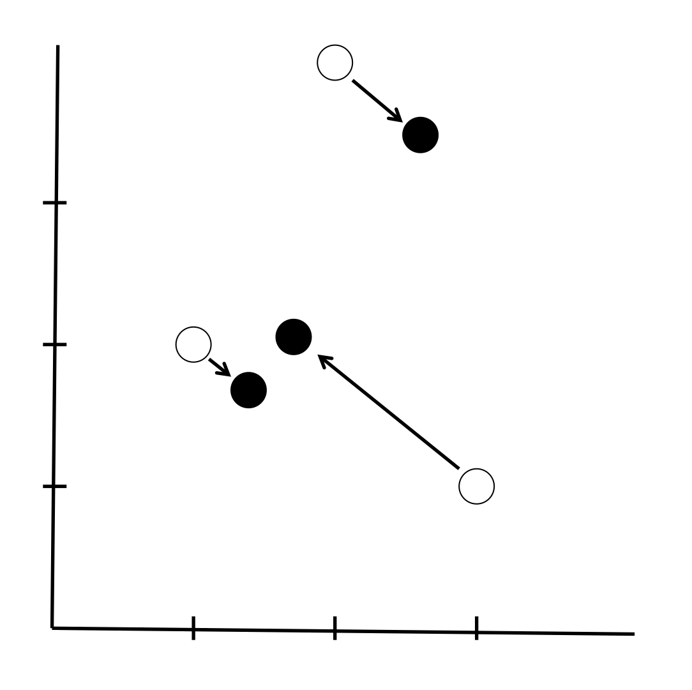

# Latent Semantic Analysis

##TL; DR
* Latent Semantic Analysis (LSA) is a [*bag of words*](Glossary.md) method of [*embedding*](Glossary.md) [*documents*](Glossary.md) into a vector space.
* Each word in our [*vocabulary*](Glossary.md) relates to a unique dimension in our vector space. For each [*document*](Glossary.md), we go through the [*vocabulary*](Glossary.md), and assign that [*document*](Glossary.md) a score for each word. This gives the [*document*](Glossary.md) a vector [*embedding*](Glossary.md).
* There are various schemes by which this scoring can be done. A simple example is to count the number of occurrences of each word in the [*document*](Glossary.md). We can also use [*IDF weighting*](Glossary.md) and [*normalisation*](Glossary.md).
* We make a [*term-document matrix (TDM)*](Glossary.md) out of our [*document*](Glossary.md) vectors. The [*TDM*](Glossary.md) defines a subspace spanned by our [*documents*](Glossary.md).
* We do a [*singular value decomposition*](https://en.wikipedia.org/wiki/Singular-value_decomposition) to find the closest rank-*k* approximation to this subspace, where *k* is an integer chosen by us. This rank reduction has the effect of implicitly redefining our [*document*](Glossary.md) [*embedding*](Glossary.md) so that it depends on *k* features, which are linear combinations of the original scores for words. This is conceptually broadly similar to [principal component analysis](https://en.wikipedia.org/wiki/Principal_component_analysis) with *k* principal components (for the exact relationship, [see e.g. here](https://intoli.com/blog/pca-and-svd/)).
* We can then define similarity between our [*documents*](Glossary.md) using [*cosine similarity*](Glossary.md): the cosine of the angle between their vectors in the rank-*k* subspace.

## Motivation

We want to find a way of [*embedding*](Glossary.md) [*documents*](Glossary.md) in a vector space in way that encodes their conceptual content. Latent Semantic Analysis (LSA) gives us a way of doing this using standard Linear Algebra.

Warning: this page includes both mathematical formulae and mathematical concepts. I've tried to keep it as simple as possible and to use examples where I can, but doubtless it can be improved upon.

## Assumptions

LSA is a [*bag of words*](Glossary.md) model, so the order of the words in a [*document*](Glossary.md) makes no difference to how it is [*embedded*](Glossary.md) in our vector space. Additionally, since every [*document*](Glossary.md) is given a single vector representation there is an implicit assumption that each document is 'about' one thing - at least, the model will work best in circumstances where [*documents*](Glossary.md) are likely to be about a handful of topics at most. This can often be achieved by defining [*documents*](Glossary.md) to be short pieces of text, for example defining them to be individual sentences.

## The vector space

The vector space is defined in terms of the [*vocabulary*](Glossary.md). Each and every word in the [*vocabulary*](Glossary.md) has its own distinct orthogonal dimension.

For example, if our [*corpus*](Glossary.md) is the Dr Seuss story "*Green Eggs and Ham*", then (after making lower case, removing [*stopwords*](Glossary.md), and [*stemming*](Glossary.md)) our [*vocabulary*](Glossary.md) is
>boat, box, car, dark, eat, egg, fox, goat, good, green, ham, hous, mous, rain, sam, train, tree

Our vector space then has 17 dimensions, each relating to one of these terms. If our [*documents*](Glossary.md) are sentences from the story, each of them will be describable by an 17-dimensional vector.

Notice that this metholodogy implicitly assumes that the 17 words in the vocabulary are orthogonal to one another, which best describes a situation where the presence of a given word in a [*document*](Glossary.md) is independent from the presence of the other words in the [*vocabulary*](Glossary.md). In practice, in the case of "*Green Eggs and Ham*", I expect we'd find that "*green*", "*egg*", and "*ham*" co-appear to a large degree. 

## Counting words

With our vector space defined, we now need a method by which we can determine each [*document*](Glossary.md)'s position along each of the axes. Recall that each axis represents a specific word in the [*vocabulary*](Glossary.md). So for each [*document*](Glossary.md), we need only find a way of giving it a score for each word in the [*vocabulary*](Glossary.md) and our [*embedding*](Glossary.md) will be done.

The simplest way of doing this is just to go through each [*document*](Glossary.md) and count the number of occurrences of each [*vocabulary*](Glossary.md) word.

To continue our "*Green Eggs and Ham*" example, the line
> I do not like green eggs and ham

after making lower case, removing [*stopwords*](Glossary.md), and [*stemming*](Glossary.md), becomes
>{green, egg, ham}

Counting the number of occurrences of each [*vocabulary*](Glossary.md) word would give an [*embedding*](Glossary.md)  (taking the dimensions in alphabetical order of the words in the [*vocabulary*](Glossary.md)). Similarly, the line
> Eat them! Eat them! Here they are!

becomes
> {eat, eat}

and gets [*embedded*](Glossary.md) as .

## Beyond counting

There are more advanced, better ways of [*embedding*](Glossary.md) [*documents*](Glossary.md) in our vector space, called "[*weighting schemes*](Glossary.md)". Typically these different schemes vary in three ways: how they take term frequency into account, how they take [*inverse document frequency*](Glossary.md) into account, and whether they [*normalise*](Glossary.md).

###Term frequency
This covers whether how the weighting scheme deals with the frequency of occurrence of each word in the [*vocabulary*](Glossary.md). Two possibilities we've investigated are
* just counting the frequency of terms; and
* scoring 1 if a term is used and 0 if it isn't.

This latter, "Boolean" scheme is what we use when doing LSA on Parliamentary Questions: the fact that a PQ mentions the word "prison" more than once (for example, asking for the same statistic about multiple named prisons) doesn't make it more about prisons.

###[Inverse document frequency](Glossary.md)
All words are not equal in information content, even once we have taken out [*stopwords*](Glossary.md). Words that appear in nearly all [*documents*](Glossary.md) in our [*corpus*](Glossary.md) will be unsurprising when we see them; their appearance in a [*document*](Glossary.md) will tell us very little about it. The appearance of a rare word in a [*document*](Glossary.md), however, may be very decisive in helping us discern its information content.

For example, the Ministry of Justice does not get many Parliamentary Questions about Britain leaving the EU. If we see the relatively rare term "*Brexit*" in a question it's a good guide to what the question is about. On the other hand, there are lots of questions about various aspects of prisons, and so the existence of the word "*prison*" in a question tells us less about its specific topical content.

Notice that we consider how rare or common the word in question is within the [*corpus*](Glossary.md) under consideration, not upon how rare or common it is in English in general. Context is everything in language: the appearance of the word "*lobster*" would not be as surprising in a headline from fishing news website [Undercurrent](https://www.undercurrentnews.com/) as it would be in a headline from football website [When Saturday Comes](http://www.wsc.co.uk/).

###[Normalisation](Glossary.md)

At some point after applying one or both of the above schemes we can choose whether or not to [*normalise*](Glossary.md) our [*document*](Glossary.md) vector so that it has unit length.

The main advantage of this step is to reduce computation time in the case where we are going to use [*cosine similarity*](Glossary.md) as our similarity measure between [*documents*](Glossary.md). If we normalise our [*document*](Glossary.md) vectors they have length one and, since the cosine rule gives

we can calculate the cosine of the angle between [*document*](Glossary.md) vectors just using the dot product. In R, at least, and I suspect in many coding languages, dot products between vectors are optimised to be very quick to calculate.

## The subspace defined by our [*documents*](Glossary.md)

So now we've embedded our [*documents*](Glossary.md) in our vector space. We can go further and define the subspace spanned by our documents by taking each of the [*document*](Glossary.md) vectors. We do this by defining a [*term-document matrix* (*TDM*)](Glossary.md): the column vectors of this matrix are our [*document*](Glossary.md) vectors, and the rows represent the words in the [*vocabulary*](Glossary.md).

The rank *r* of this matrix (equivalently the rank of the subspace spanned by our [*corpus*](Glossary.md)) will be bounded above by whichever is the smaller out of the size of the [*vocabulary*](Glossary.md) and the number of [*documents*](Glossary.md). This value *r* can be thought of as the number of parameters we would need to be able to fully describe any of our [*documents*](Glossary.md) (under this [*weighting scheme*](Glossary.md)).

What if we think that we could describe our [*documents*](Glossary.md) with fewer parameters than this? What if we think that there are really *k* "hidden" parameters that can sufficiently describe any of our [*documents*](Glossary.md)?

Amazingly, thanks to the wonders of linear algebra, we can use our [*term-document matrix*](Glossary.md), representing the rank-*r* description of our documents due to our original [*weighting scheme*](Glossary.md), to generate the unique rank-*k* description of our documents that is "closest" to the original description (closest in the sense of "least-squares"). That is, we can automatically generate an [*embedding*](Glossary.md) of our [*documents*](Glossary.md) that
* is of rank *k*; and
* 'throws away' the least information from our original [*embedding*](Glossary.md), in some sense.

## Singular value decomposition

There are plenty of other sites that go through the maths behind Singular value decomposition (SVD) in detail so I won't do that here.

Suffice it to say that we can transform our [*TDM*](Glossary.md) **M** into three matrices **U**, **Σ**, and **V**, such that **X = U Σ V^T^**, where **V^T^** is the transpose of a matrix **V**. **Σ** is a diagonal matrix uniquely defined by **M**. It turns out that the rank-*k* [*embedding*](Glossary.md) for our [*documents*](Glossary.md) that is closest to our original embedding is given by the matrix **M~k~ = U Σ~k~ V^T^** where **Σ~k~** is simply our diagonal matrix with all but the first *k* entries changed to zero.

If we want to get the coordinates of our new rank-*k* [*embedding*](Glossary.md) of our [*documents*](Glossary.md) in the original vector space, they will correspond to the column vectors of **M~k~**. If we want to get the coordinates of our new rank-*k* [*embedding*](Glossary.md) with respect to a basis defining our rank-*k* subspace, so that we can start looking at similarity of [*documents*](Glossary.md) under to this new [*embedding*](Glossary.md), they are given by **Σ~k~ V^T^**. Needless to say, I'm leaving all proofs of all of these statements as "an exercise for the reader"...

## An example with toy data

Just to help you see the sort of thing, here's a toy example. It's necessarily of very low dimension so that it's possible for our tiny human brains to envision it.

Let's suppose our original [*embedding*](Glossary.md) gives a [*term-document matrix*](Glossary.md)

where we have three documents and two terms. I will leave it to the reader to construct thrilling examples of what the terms might be and thus recreate the documents.

We then do a singular-value decomposition and get

where all values are given to 2 decimal places, rather than giving precise expressions. Our best 1-dimensional approximation to this is then

<a href="https://www.codecogs.com/eqnedit.php?latex=\begin{matrix}&space;\mathbf{M_1}&space;&&space;=&space;&&space;\begin{bmatrix}&space;0.61&space;&&space;0.79&space;\\&space;0.79&space;&&space;-0.61&space;\end{bmatrix}&space;\begin{bmatrix}&space;5.56&space;&&space;0&space;\\&space;0&space;&&space;0&space;\end{bmatrix}&space;\begin{bmatrix}&space;0.39&space;&&space;0.79&space;&&space;0.47&space;\\&space;-0.21&space;&&space;-0.42&space;&&space;0.88&space;\end{bmatrix}&space;\\&space;&&space;=&space;&&space;\begin{bmatrix}&space;1.33&space;&&space;2.67&space;&&space;1.59&space;\\&space;1.74&space;&&space;3.48&space;&&space;2.08&space;\end{bmatrix}&space;\end{matrix}" target="_blank"></a>

The following diagram shows this. The white circles are the original positions of our [*documents*](Glossary.md) in our 2-dimensional vector space in which the axes are terms in our 2-word [*vocabulary*](Glossary.md). The black dots are their positions on our best rank-1 approximation to the original space. The singular value decomposition tells us the best way of fitting the white points onto a line while losing the minimum of information (technically we move the points the smallest squared distance).

We can calculate the coordinates of our new [*embedding*](Glossary.md) (the black points) as

This is somewhat absurd when our new [*embedding*](Glossary.md) has rank 1, but it shows that the black points that was at (1, 2) moves to a position 2.19 along the rank 1 subspace, the point that was at (2, 4) moves to a position 4.39 along this line, and the point that was at (3, 1) moves to a position 2.62 along this line. You can imagine that this new basis for the subspace we have created is of more use when the new [*embedding*](Glossary.md) is of (much) higher rank than 1.

We could equivalently view our system as being the coordinates of terms in 3-dimensional [*document*](Glossary.md) space. In this case our svd reduces this space to an equivalent rank 1 subspace, and in this space the terms are located at

Additionally, this allows us to derive an equation describing the line of which the black points in the diagram sit - it is *y* = (4.41 / 3.38) *x*.

Finally, note that in terms of being an algorithm that
* uses matrix algebra; and
* results in the creation of a reduced-rank subspace; which
* is somehow closest to the original space; and
* has a basis that is a linear combination of the original basis vectors

SVD is clearly similar in ethos to principal component analysis. [Obviously the two can be formally compared](https://intoli.com/blog/pca-and-svd/).

## The point of all this madness

Deep breath now, the hardcore (well, first year Linear Algebra course, which is hard for me) maths is done. We can now see the point of all this.

First, a recap:
* We defined an initial [*embedding*](Glossary.md) for our [*documents*](Glossary.md) based on the words that remained in the [*vocabulary*](Glossary.md) after we had done our [*feature selection*](FeatureSelection.md), and using some sort of [*weighting scheme*](Glossary.md) of our choice.
* We did some ~~magic~~ Linear Algebra to reduce the rank of our initial embedding so that all our our [*documents*](Glossary.md) now lie on some sort of *k*-dimensional hyperplane.

Why is this good? Take a look at the diagram above again. The black points lie on a line. They are the best one-dimensional approximation to our 2-dimensional original [*embedding*](Glossary.md). If we think that there is random noise in our system (e.g. there is an element of chance in what words appear in our [*document*](Glossary.md) even once their actual topical content is determined), we might say that we should approximate the system by the line on which the black points sit, so that our real data (the white points) is made up of the black points (the signal) plus some noise term.

We might say that, once we take randomness out of the picture, the points that end up closer to one another are "truly" closer in information content than ones that end up far away. Reducing the dimensionality gives us a model that doesn't overfit - in particular, it doesn't take synonyms as being separate entities, but (at least hopefully) sees them as meaning similar things (because synonyms will tend to co-occur with similar terms).

### The bottom line

Once you've got your rank-*k* subspace, and the coordinates of your new [*embedding*](Glossary.md) on this *k*-dimensional hyperplane, you can do your similarity measure on this and do [*Search*](Search.md) and also [*clustering*](Glossary.md) to do [*Topics*](Topics.md).

## Similarity measures

The standard similarity measure to use when comparing [*embedded*](Glossary.md) [*documents*](Glossary.md) is [*cosine similarity*](Glossary.md). In practice everyone seems to use this.

In actual fact we always (re)[*normalise*](Glossary.md) our [*embedding*](Glossary.md) so that everything is on a hypersphere: under these circumstances (I think) Euclidean distance and [*cosine similarity*](Glossary.md) are equivalent.

I am slightly worried as I write this that our re[*normalisation*](Glossary.md) at this stage reduces the dimensionality of our newly-created subspace by one, and in doing means we are doing our similarity on a space that is *not* the closest rank *k*-1 subspace of our original vector space. This might be a problem, but in practice our methods appear to work ok. I'd be loathe to throw out the normalisation as it gives such speed benefits; if any linear algebra whiz wants to tell me how to find the best rank $k$ hyperspherical approximation to a given space I would love to hear it.
